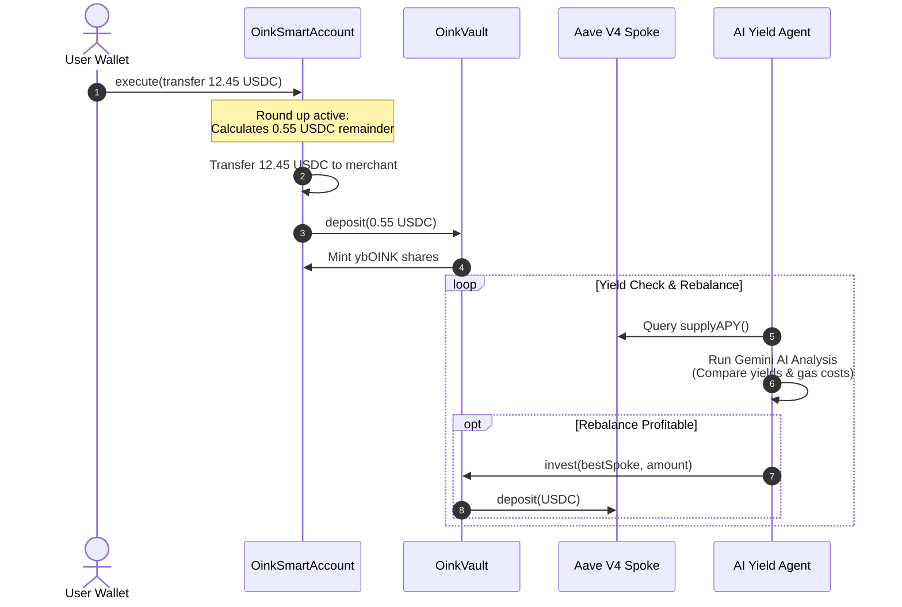

# 🐷 Oink Protocol

[](https://www.typescriptlang.org/)
[](https://soliditylang.org/)
[](https://react.dev/)
[](https://book.getfoundry.sh/)
[](https://deepmind.google/technologies/gemini/)
[](LICENSE)

**A casual, safe, and convenient gateway to DeFi. Oink automatically converts spare change from your daily smart wallet transactions into optimal yield-bearing positions using automated AI allocators.**

---

## 🎯 Why We Built Oink

DeFi holds the promise of financial inclusion and wealth generation. However, for everyday people who are **not familiar with finance**, it remains incredibly intimidating:

*   **High Cognitive Barriers**: Understanding liquidity pools, yield farming, APYs, gas fees, and rebalancing is exhausting.
*   **Constant Monitoring**: Yields shift daily across different pools, requiring continuous observation to maximize returns.
*   **Complex UI/UX**: Standard web3 wallets require users to sign dozens of complex transactions, manage multiple accounts, and manually transfer funds.

### 🐷 The Oink Philosophy
Oink turns DeFi into a passive, friction-free micro-savings game:
*   **Spare Change Savings**: Every time you send USDC (e.g., paying a merchant), Oink rounds the transaction up to the nearest dollar and saves the difference.
*   **Hands-Free Optimization**: An off-chain AI Yield Optimizer Agent continuously reallocates your aggregate savings to the highest-yielding opportunities (like Aave V4 spokes) on your behalf.
*   **Convenient UI**: A simple, mobile-friendly web dashboard lets you track your micro-savings, see your yield-bearing shares (`ybOINK`), and manage your settings.

---

## 🚀 The Oink Solution

Oink consists of three core components:

1.  **OinkSmartAccount (Smart Wallet)**: An ERC-4337-like smart account that automatically intercepts your USDC transfers and "rounds up" the transfer amount. The remainder is automatically deposited into the `OinkVault`.
2.  **OinkVault (ERC-4626 Yield Vault)**: An ERC-4626 compliant yield-bearing vault. It aggregates all users' USDC micro-savings, mints `ybOINK` shares to depositors, and exposes secure investment controls (`invest` / `withdraw`) to an authorized agent.
3.  **AI Yield Optimizer Agent**: A node agent powered by Google Generative AI (Gemini). It polls APYs from multiple pools (e.g. Mock Aave V4 spokes), calculates profitability (accounting for gas fees and net yields), and rebalances the vault assets automatically.

---

## 🛠️ Technical Architecture

### Architecture Overview



### The Three-Layer Architecture:

```
┌─────────────────────────────────────────────────────────────┐
│ 1. User Interface Layer (Vite + React + Biconomy SDK)       │
│ - Control panel to toggle Round-Up and change policies      │
│ - View balances, smart account owner, and ybOINK shares     │
└──────────────────────────────┬──────────────────────────────┘
                               │ Transactions / Settings
                               ▼
┌─────────────────────────────────────────────────────────────┐
│ 2. Smart Contract Layer (Foundry + Solidity)                │
│ - OinkSmartAccount: Intercepts & rounds up USDC transfers   │
│ - OinkVault: Aggregates USDC & mints ybOINK (ERC-4626)       │
│ - MockAaveV4Spoke: Simulates high-yield lending spokes      │
└──────────────────────────────▲──────────────────────────────┘
                               │ Rebalance Allocations
                               ▼
┌─────────────────────────────────────────────────────────────┐
│ 3. Intelligent Agent Layer (NodeJS + Viem + Gemini AI)      │
│ - Constantly polls spoke supplyAPY()                        │
│ - Compares yield returns vs network transaction costs       │
│ - Autonomously calls invest() or withdrawFromProtocol()      │
└─────────────────────────────────────────────────────────────┘
```

---

## 📁 Project Folder Structure

```bash
Oink-Protocol/
├── contracts/                     # Foundry smart contract project
│   ├── src/                       # Solidity source contracts
│   │   ├── OinkSmartAccount.sol   # Round-up smart account wallet
│   │   ├── OinkVault.sol          # ERC-4626 micro-savings yield vault
│   │   └── MockAaveV4Spoke.sol    # Aave V4 mock spoke contract for testing
│   ├── test/                      # Smart contract unit tests
│   ├── script/                    # Contract deployment scripts
│   └── foundry.toml               # Foundry configuration file
│
├── wallet-frontend/               # React + TS + Vite web application
│   ├── src/                       # Frontend source files
│   │   ├── App.tsx                # Main dashboard component
│   │   ├── index.css              # Premium responsive styles
│   │   └── utils/
│   │       └── web3.ts            # Ethers/Viem helper scripts
│   └── package.json               # Frontend dependencies & npm scripts
│
└── yield-optimizer-agent/         # AI-powered yield allocator agent
    ├── agent.ts                   # Core agent logic (Gemini + Viem integration)
    ├── package.json               # Node.js dependencies
    └── tsconfig.json              # TypeScript configuration
```

---

## ⚡ Quick Start

### Prerequisites
*   [Foundry](https://book.getfoundry.sh/getting-started/installation) (for compiling/testing contracts)
*   [Node.js](https://nodejs.org/) v18+ & npm (for running frontend and agent)

---

### 1. Smart Contracts

Move to the `contracts` directory:
```bash
cd contracts
```

#### Install dependencies:
```bash
forge install
```

#### Build contracts:
```bash
forge build
```

#### Run tests:
```bash
forge test
```

---

### 2. Wallet Frontend Dashboard

Move to the `wallet-frontend` directory:
```bash
cd wallet-frontend
```

#### Install dependencies:
```bash
npm install
```

#### Start the local development server:
```bash
npm run dev
```
Open http://localhost:5173 to interact with the dashboard.

---

### 3. AI Yield Optimizer Agent

Move to the `yield-optimizer-agent` directory:
```bash
cd yield-optimizer-agent
```

#### Install dependencies:
```bash
npm install
```

#### Set up environment variables:
Create a `.env` file in the `yield-optimizer-agent` folder following `.env.example`:
```env
GEMINI_API_KEY="your_gemini_api_key"
SOURCE_RPC_URL="https://rpc.testnet.arc.network"
DESTINATION_RPC_URL="https://rpc.testnet.arc.network"
ALLOCATOR_PRIVATE_KEY="your_private_key_with_allocator_role"
OINK_VAULT_ADDRESS="deployed_oink_vault_address"
USDC_ADDRESS="deployed_usdc_address"
CANDIDATE_POOLS="pool_address_1,pool_address_2,pool_address_3"
NET_PROFIT_THRESHOLD="5.0"
PROJECTED_DAYS="30"
PRINCIPAL_AMOUNT="10000"
POLLING_INTERVAL_SECONDS="300"
```

#### Run the agent:
```bash
npm start
```

---

## 📜 License

This project is licensed under the MIT License. See the [LICENSE](LICENSE) file for details.
